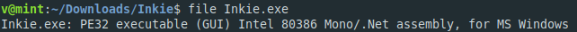
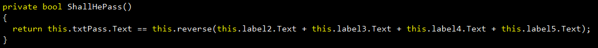
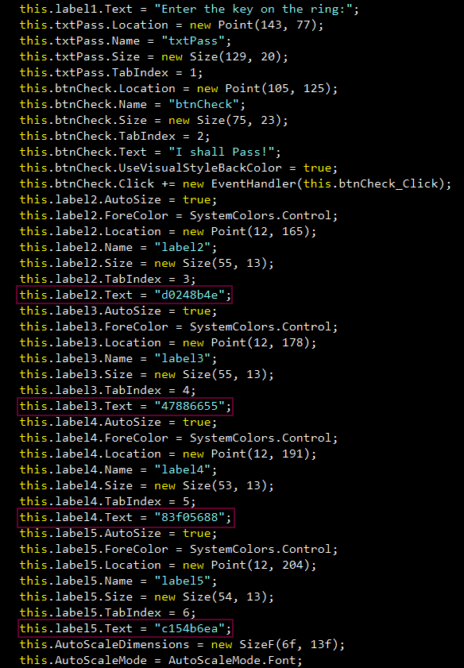
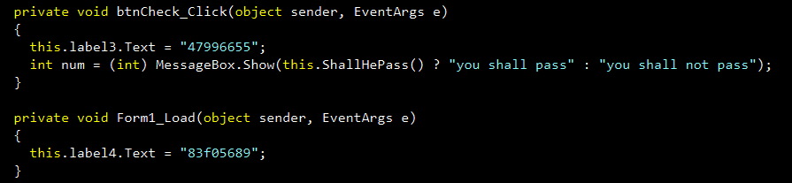

**Eye of Sauron**
===================  
[Challenge Link](https://s3-eu-west-1.amazonaws.com/talentchallenges/Reverse/Inkie.zip)  

> Can you find the key to pass?  

Let's determine the file type

Run it on a windows machine.. It will open a dialogue box.  
We don't have the source code so let's decompile it.. I use [dotPeek](https://www.jetbrains.com/decompiler/) but you can use whatever you like.  
Going through the code you will find this function

Cool! let's search for these values and reverse them to get the flag

Go submit it and it won't be correct.. ugh what did we forget? Let's check again

label3 changes when you click the button and label4 is assigned to another value.  
Now you have the correct values.. Reverse them.. Get the flag!
