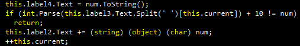
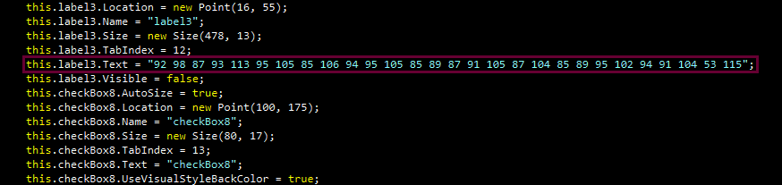
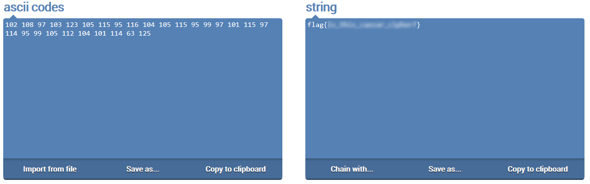

**GUI I**
===================  
[Challenge Link](https://s3-eu-west-1.amazonaws.com/hubchallenges/Reverse/GUI.exe)

> The correct input is the flag.
> Format flag{xxxxxxxxxxxxxxxxxxxxxxxxxxxxxx}  

Open it.. There are some checkboxes but not a single inputbox.  
Let's decompile it.. I used [dotPeek](https://www.jetbrains.com/decompiler/).  
Going through the code.. I noticed this interesting function.

Why is it interesting? because it converts some numbers to a string which might be our flag!  
Let's get these numbers.

I used this [online converter](https://onlinestringtools.com/convert-ascii-to-string).  
Note: Don't forget to add 10.

