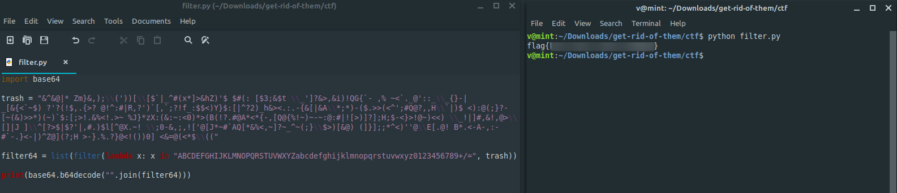

**Get rid of them all**
===================  
[Challenge Link](https://s3-eu-west-1.amazonaws.com/hubchallenges/Reverse/get-rid-of-them.jar)

> Someone corrupted the file so that we cannot execute it and we need your help to get the flag.  
> Format: flag{xxxxxxxxxxxxxxxxxxxxxxxxxxxxxx}

We don't have the source code so we need to decompile these files.. I used this [online decompiler](http://www.decompiler.com/).

Going through the code.. `ctf.java` prints the flag after it's decrypted using `ooo.java`.  
The `_1` function decodes the string created by the `_2` function.  
The `_2` function iterates to create the flag.. No values are edited.  
We knew it's a base64 decrypted string so I thought of filtering the string rather than following along with `_2`.

Let's remove unnecessary charcters then decode it.  

