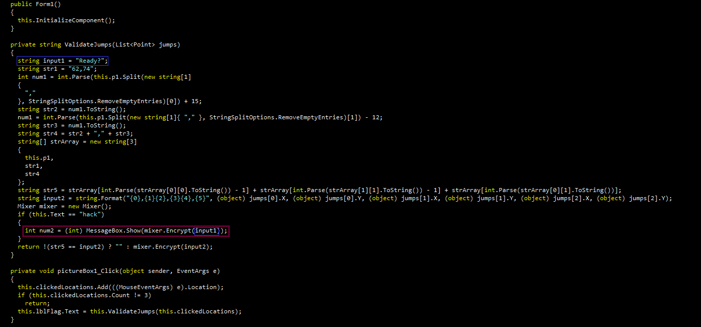
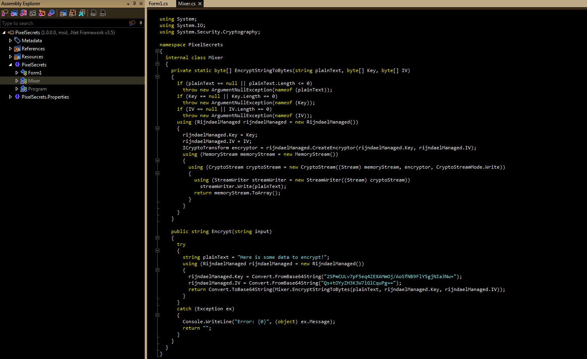

**Jumping Pixels**
===================  
[Challenge Link](https://s3-eu-west-1.amazonaws.com/hubchallenges/Reverse/PixelSecrets.exe)

> You need to jump the right sequence in order to get the key.  

I used [dotPeek](https://www.jetbrains.com/decompiler/) to decompile this file.  
It's a C# code.. you don't need to fully understand it.  
Going through the code I noticed this

It's the only function that prints a string to the user in the entire code.. I bet it got the flag.  
Let's check the `Mixer` class.

The `Encrypt` function takes one argument and does some kind of encryption we don't need to understand.  
We need to create an object from this class in order to print the flag.

Use whatever compiler you like to run this code.. I used [this one](https://www.onlinegdb.com/).
