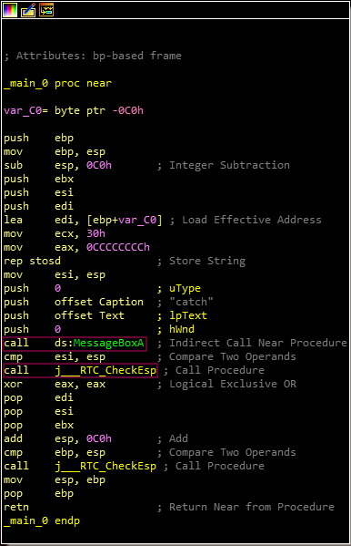
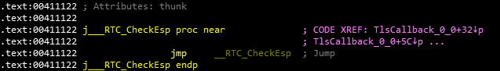
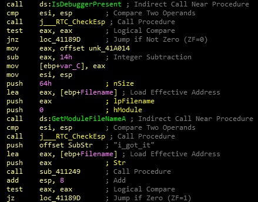

**Catch me**
===================  
[Challenge Link](https://s3-eu-west-1.amazonaws.com/hubchallenges/Reverse/a.out)

> Catch me if you can.  

We got a PE32 executable file.. Let's open it with IDA.  
Starting with the main function.

We got two function calls, `MessageBoxA` didn't tell me much.  
Let's jump to `j___RTC_CheckEsp`.  

[Tlscallback](https://www.hex-rays.com/blog/tls-callbacks/).. hmmm, let's check it out.

It checks the file name.. If it's `i_got_it` then it will print you the flag.  
Rename the file to `i_got_it.exe` then execute it.. boooom you got the flag :D
