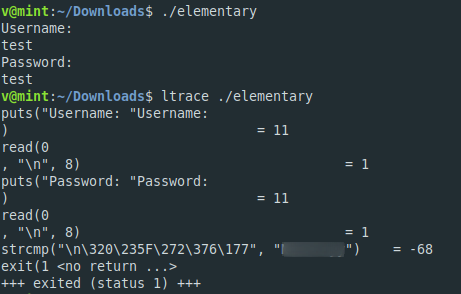

**Elementary**
===================  
[Challenge Link](https://s3-eu-west-1.amazonaws.com/hubchallenges/Reverse/elementary)

> Here we've prepared a simple program.. Crack me if you can!  

We got an ELF file.. I gave it the permission to execute.  
I ran it.. It asked for a username and a password.  
I tried *test* to see what we would get.. as you can see.. nothing.  
I tried `ltrace` to get the library calls.. I noticed `strcmp` which compares two strings.  
I tried submitting the string it compares with and It worked.. easy peasy lemon squeezy :D!
