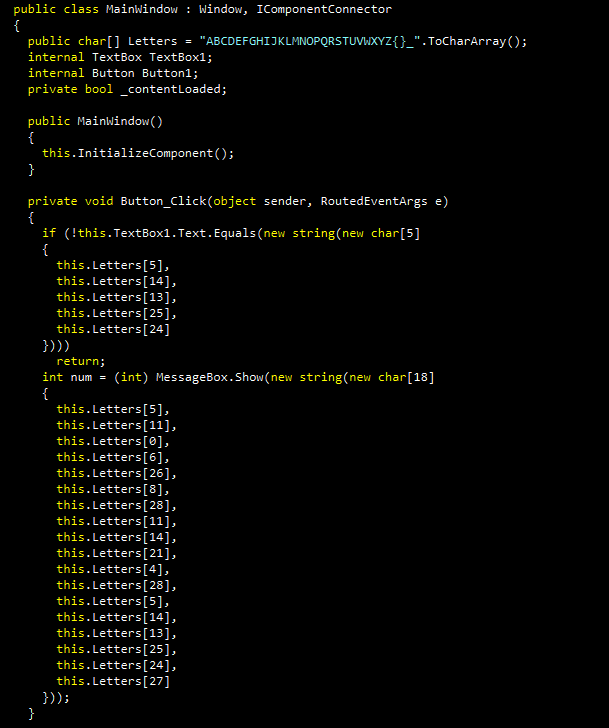
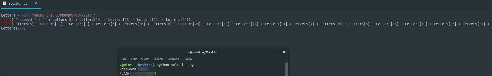

**I love this guy**
===================  
[Challenge Link](https://s3-eu-west-1.amazonaws.com/hubchallenges/Reverse/ScrambledEgg.exe)

> Can you find the password to obtain the flag?  

I used [dotPeek](https://www.jetbrains.com/decompiler/) to decompile this file.  
It's a C# code.. you don't need to fully understand it.  
Going through the code I noticed this

`TextBox` takes input from the user.  
`MessageBox` prints a string to the user.  

This very basic python script got us the flag from this basic C# code.  
I don't know why this challenge's difficulty is medium on CyberTalents.
