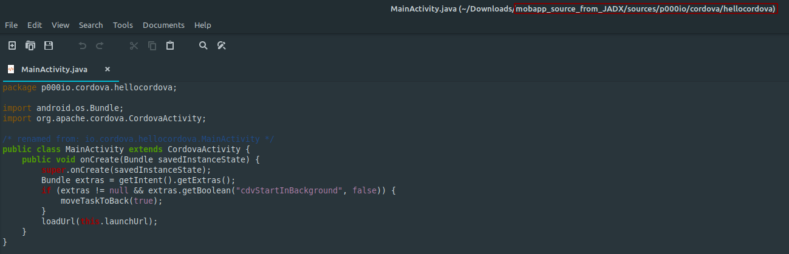
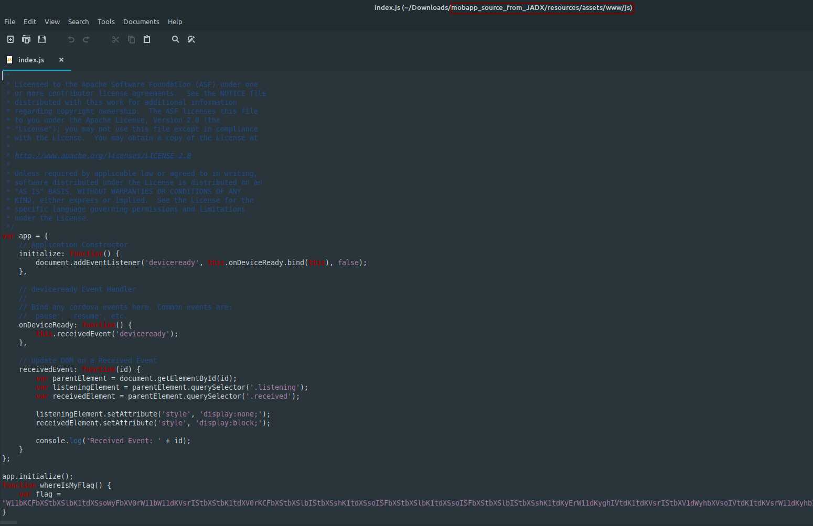
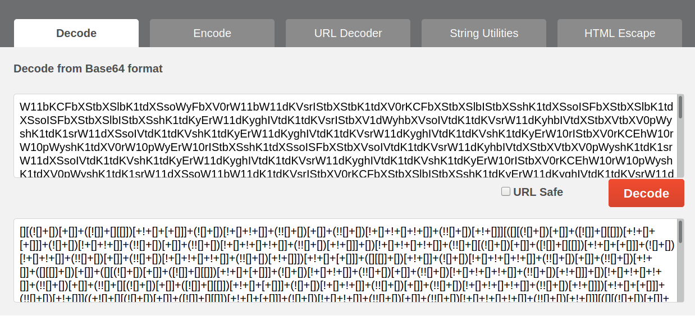

**Mobile App**
===================  
[Challenge Link](https://s3-eu-west-1.amazonaws.com/hubchallenges/Reverse/mobapp.apk)

> Reverse-engineer the APK to find the flag.

I used this [site](http://www.javadecompilers.com/) to decompile the APK.  
Let's check the main function

It didn't tell us much.  
Let's check the resources for cordova files (as you can see they are imported so one of them might have the flag).  
I spent some time going through them and I finally got it

It was so long that I couldn't fit it in one screenshot.. when I submitted it the site crashed lol.  
It's a Base64 encrypted string so let's decrypt it.. I used this [site](https://www.base64code.com/).

ugh.. another encryption layer.. I knew this format from a previous challenge I solved `Iam Legend`.. It's JSFuck.  
Decode it however you like.. I used this [site](https://enkhee-osiris.github.io/Decoder-JSFuck/).
