**Beginner's Luck**
===================  
[Challenge Link](https://github.com/stuxnet999/MemLabs/tree/master/Lab%201)  

> My sister's computer crashed. We were very fortunate to recover this memory dump. Your job is get all her important files from the system.  
> From what we remember, we suddenly saw a black window pop up with something being executed.  
> When the crash happened, she was trying to draw something. Thats all we remember from the time of crash.

The description gave me couple clues:  
- The black window with something being excuted is CMD.  
- The application she was drawing with is mostly MS Paint.

Let's use the [imageinfo](https://github.com/volatilityfoundation/volatility/wiki/Command-Reference#imageinfo) command to get the suggested profile which we will pass as the parameter to `--profile` when using other plugins.

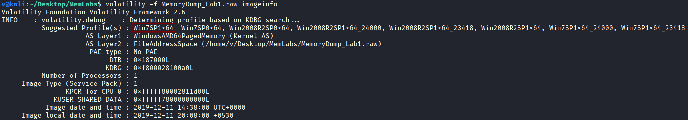  

Good, let's check the active processes when this memory dump was taken.. to do so, I will use the [pslist](https://github.com/volatilityfoundation/volatility/wiki/Command-Reference#pslist) plugin.

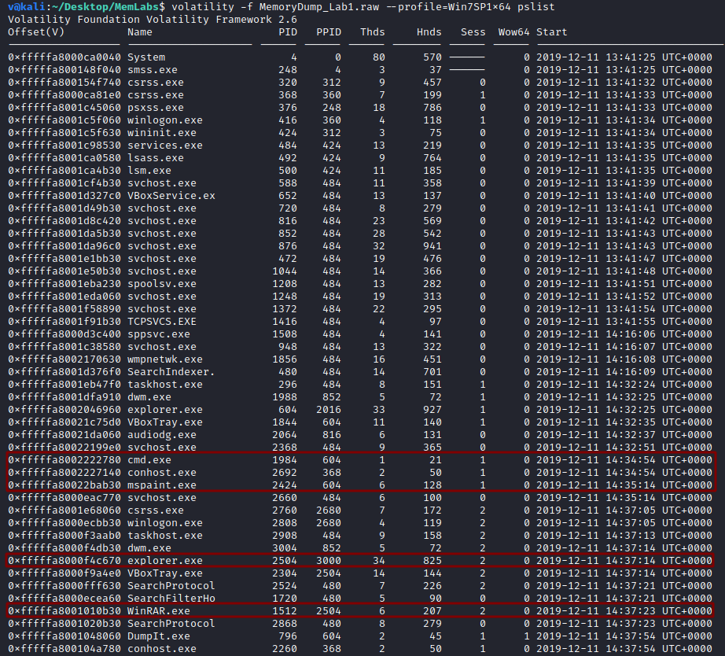  

Interesting! let's check what was excuted on CMD.. to do so, I will use the [consoles](https://github.com/volatilityfoundation/volatility/wiki/Command-Reference#consoles) plugin.

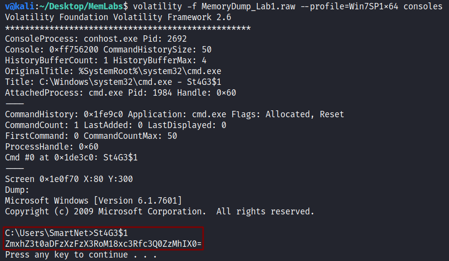  

Base64 encoded string, decode however you like, It's our flag!  

> **flag{th1s_1s_th3_1st_st4g3!!}**

--------------------------------------------
We need to dump the process memory content then to see what she was doing on MS Paint.. to do so, I will use the [memdump](https://github.com/volatilityfoundation/volatility/wiki/Command-Reference#memdump) plugin.

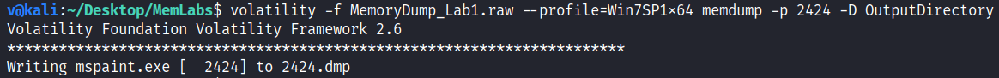

We need to change its extension to `.data` in order to open it with [GIMP](https://www.gimp.org/).  
After opening it.. I didn't know what to do, so I played with the values till I managed to notice some readable words.

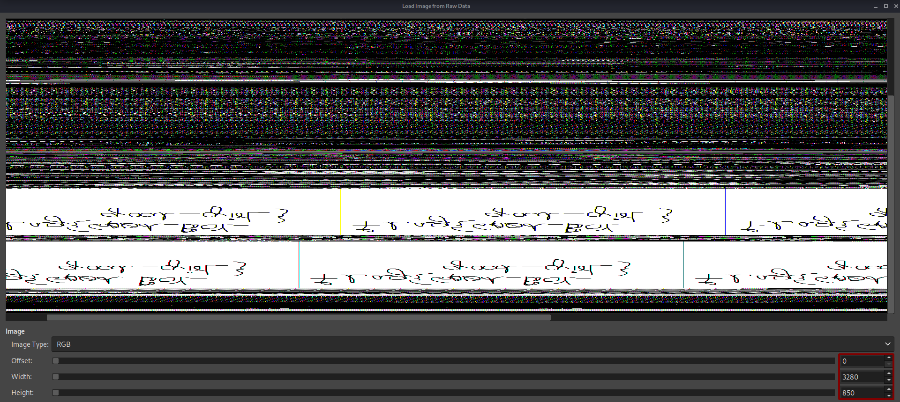

We need to flip it.. to do so, `Right Click > Image > Transform > Flip Vertically` 

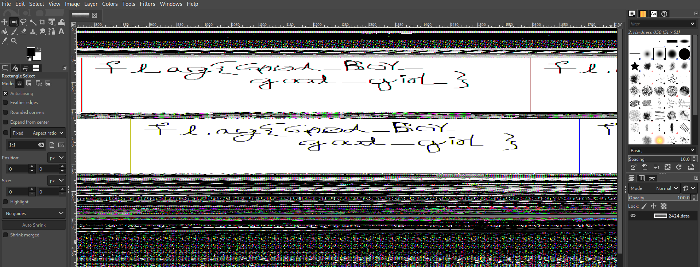

> **flag{G00d_BoY_good_girL}**

--------------------------------------------

Now let's check the WinRAR process, It might have the last flag.  
I did that using [cmdline](https://volatilityfoundation.github.io/volatility/db/d6a/classvolatility_1_1plugins_1_1cmdline_1_1_cmdline.html) plugin to check the command-line arguments.

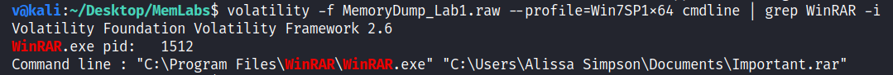

Apperantly, we got an ***important*** file :D  
Let's use the [filescan](https://github.com/volatilityfoundation/volatility/wiki/Command-Reference#filescan) plugin to check if there're any other important files in the `Documents` directory.

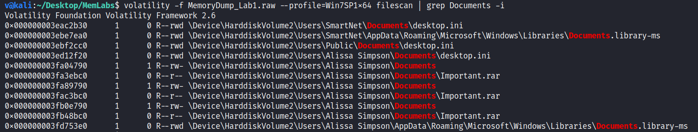

Nothing seems more ***important*** than the file we already saw, we need to dump it to check its content, I will use the [dumpfiles](https://github.com/volatilityfoundation/volatility/wiki/Command-Reference#dumpfiles) plugin and pass the physical address as a parameter to `-Q`

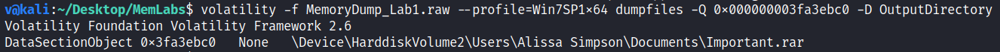

I tried to extract its content, but it was password protected.  
I decided to check the readable strings to check if the password is hidden somewhere.

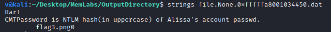

Okay, we need to dump the password hashes.. to do so, I will use the [hashdump](https://github.com/volatilityfoundation/volatility/wiki/Command-Reference#hashdump) plugin.

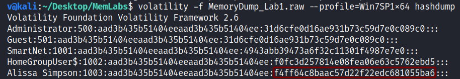

Don't forget to convert the hash characters to uppercase then use it as the password without cracking it, after doing so, you will find the last flag :D

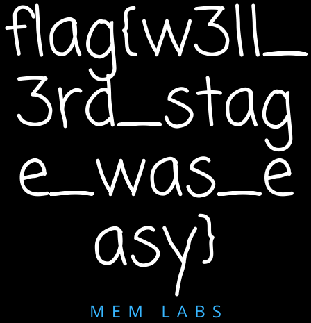

> **flag{w3ll_3rd_stage_was_easy}**
--------------------------------------------
