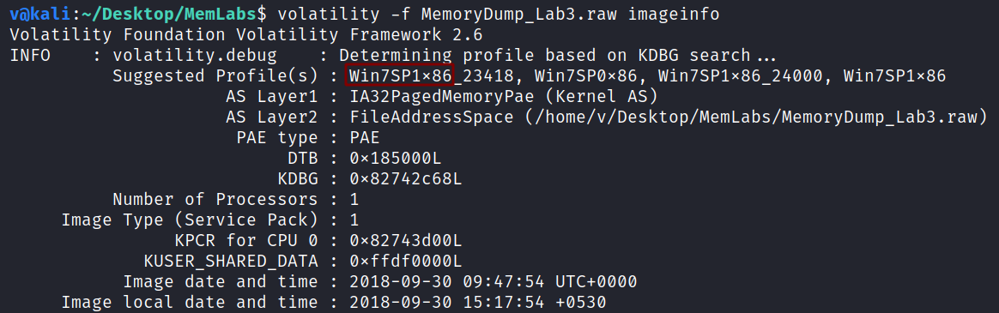
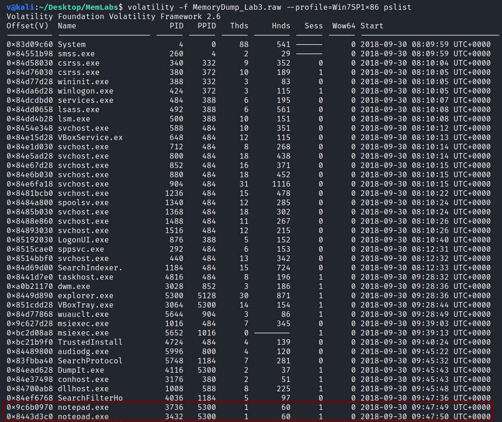
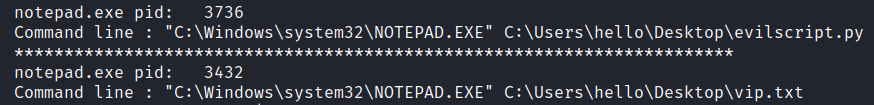
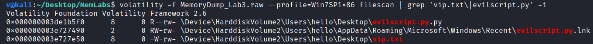
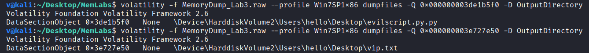
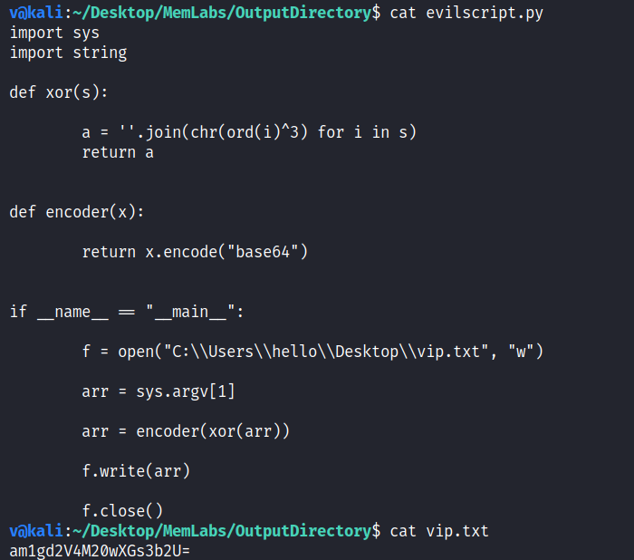
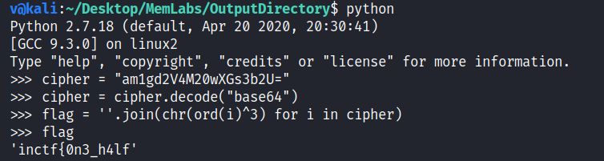
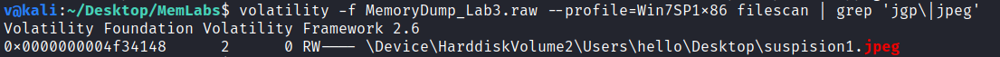
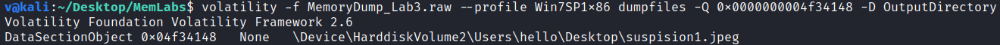
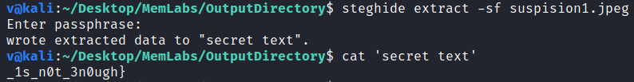

**The Evil's Den**
===================  
[Challenge Link](https://github.com/stuxnet999/MemLabs/tree/master/Lab%203)  
[My Video Walkthrough](https://www.youtube.com/watch?v=F8sLYUutb7s)

> A malicious script encrypted a secret piece of information I had on my system. Can you recover the information for me please?  
> Note 1: This challenge is composed of only 1 flag into 2 parts, format: inctf{s0me_l33t_Str1ng}  
> Note 2: You'll need the first half of the flag to get the second.  
> Note 3: You will need steghide to solve the challenge.  

Let's use the [imageinfo](https://github.com/volatilityfoundation/volatility/wiki/Command-Reference#imageinfo) command to get the suggested profile which we will pass as the parameter to `--profile` when using other plugins.

  

Let's check the active processes when this memory dump was taken.. to do so, I will use the [pslist](https://github.com/volatilityfoundation/volatility/wiki/Command-Reference#pslist) plugin.

  

Since we're looking for a malicious script I thought that `notepad.exe` is an interesting process, let's check the command-line arguments.  
To do so, I will use the [cmdline](https://volatilityfoundation.github.io/volatility/db/d6a/classvolatility_1_1plugins_1_1cmdline_1_1_cmdline.html) plugin. 

  

Interesting! We need to get their physical address in order to dump them.. to do so, I will use the [filescan](https://github.com/volatilityfoundation/volatility/wiki/Command-Reference#filescan) plugin.

  

Let's dump them.. to do so, I will use the [dumpfiles](https://github.com/volatilityfoundation/volatility/wiki/Command-Reference#dumpfiles) plugin and pass the physical address as a parameter to `-Q`  

  

After changing their names and extensions, I opened the files.

  

Easy, the script XORs the string from `vip.txt` with 3.  
Here's a simple python script to decrypt it.

  

The author told us we will be using `steghide` which is a jpg/jpeg steganography tool, so let's scan the files looking for pictures.

  

Only one! let's dump it then.

  

I ran steghide against the picture, but it needed a password.  
The author said ***You'll need the first half of the flag to get the second*** so I used the first half of the flag as the password.

  

> **inctf{0n3_h4lf_1s_n0t_3n0ugh}**

--------------------------------------------
