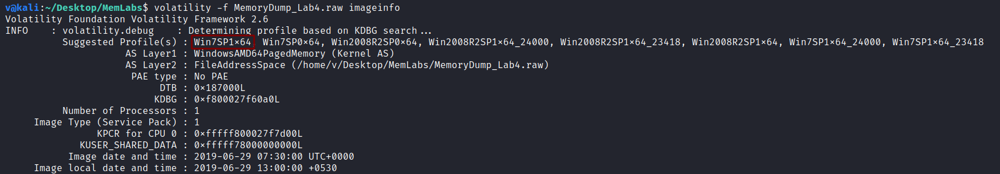
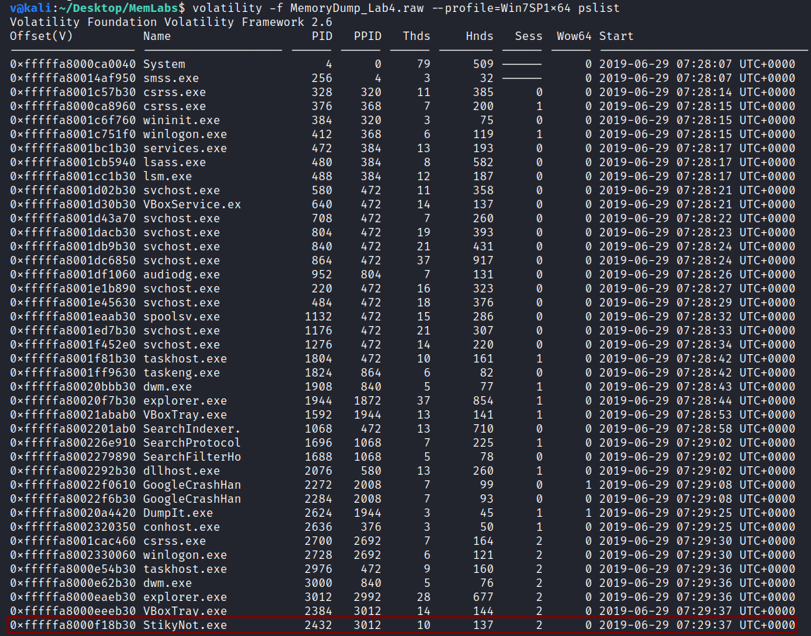
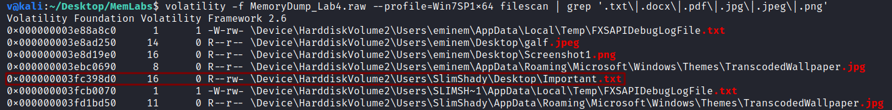
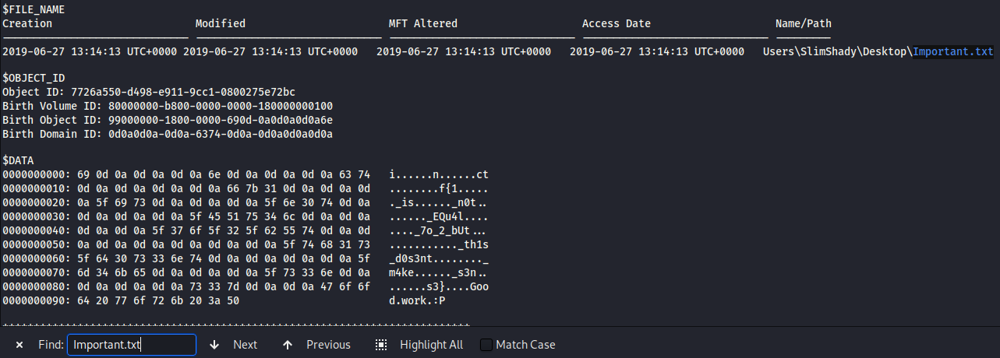

**Obsession**
===================  
[Challenge Link](https://github.com/stuxnet999/MemLabs/tree/master/Lab%204)  

> My system was recently compromised. The Hacker stole a lot of information and he also deleted a very important file of mine.  
> The only evidence we have at this point of time is this memory dump.. please help me.  
> This challenge is composed of only 1 flag and its format is inctf{s0me_l33t_Str1ng}

Let's use the [imageinfo](https://github.com/volatilityfoundation/volatility/wiki/Command-Reference#imageinfo) command to get the suggested profile which we will pass as the parameter to `--profile` when using other plugins.

Let's check the active processes when this memory dump was taken.. to do so, I will use the [pslist](https://github.com/volatilityfoundation/volatility/wiki/Command-Reference#pslist) plugin.

After spending some time analysing this process, it led to nothing.

In the description the author said ***he deleted a very important file*** so let's use the [filescan](https://github.com/volatilityfoundation/volatility/wiki/Command-Reference#filescan) plugin to search for common files extensions.

Interesting! I tried to dump it using the [dumpfiles](https://github.com/volatilityfoundation/volatility/wiki/Command-Reference#dumpfiles) plugin as usual but it resulted an error.  
After some googling I learnt from this [article](https://steemit.com/security/@nybble/forensic-extraire-des-fichiers-depuis-la-table-mft-avec-volatility-part-1-en) how to extract [MFT entries](https://whereismydata.wordpress.com/2009/06/05/forensics-what-is-the-mft/) using the [mftparser](https://github.com/volatilityfoundation/volatility/wiki/Command-Reference#mftparser) plugin.  
I opened the dumped file and searched for Important.txt

> **inctf{1_is_n0t_EQu4l_7o_2_bUt_th1s_d0s3nt_m4ke_s3ns3}**

--------------------------------------------
