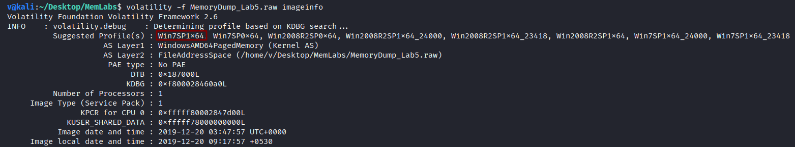
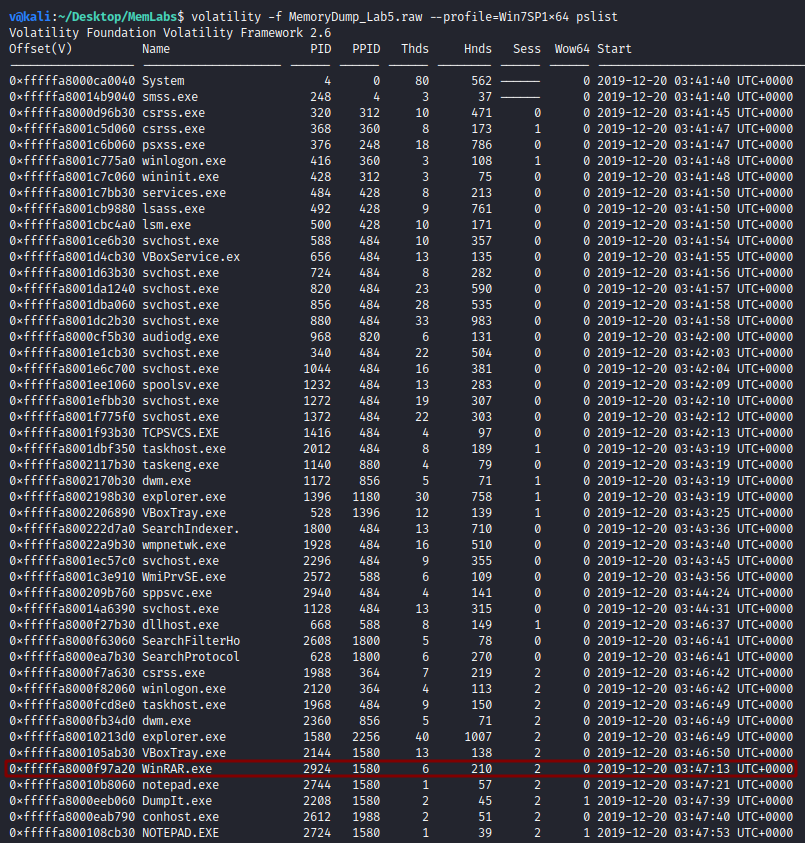
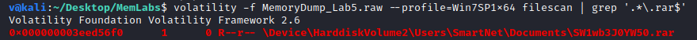
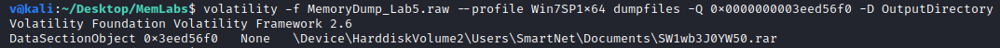
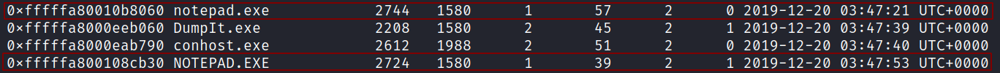
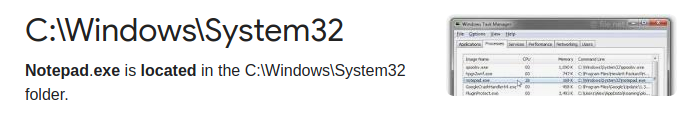
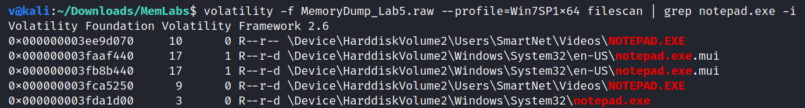
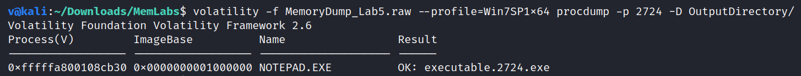
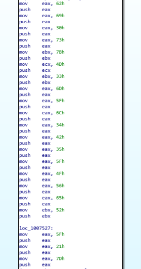

**Black Tuesday**
===================  
[Challenge Link](https://github.com/stuxnet999/MemLabs/tree/master/Lab%205)  
[My Video Walkthrough](https://www.youtube.com/watch?v=LRis5SxeCvU)

> We received this memory dump from our client recently. Someone accessed his system when he was not there and he found some rather strange files being accessed. Find those files and they might be useful.  
> Note: There're 3 flags in this challenge, you will get the stage 2 flag only when you have the stage 1 flag.

Let's use the [imageinfo](https://github.com/volatilityfoundation/volatility/wiki/Command-Reference#imageinfo) command to get the suggested profile which we will pass as the parameter to `--profile` when using other plugins.

  

Let's check the active processes when this memory dump was taken.. to do so, I will use the [pslist](https://github.com/volatilityfoundation/volatility/wiki/Command-Reference#pslist) plugin.

  

Since `WinRAR.exe` is active, there must be a `.rar` file somewhere, let's find it!  
To do so, I will use the [filescan](https://github.com/volatilityfoundation/volatility/wiki/Command-Reference#filescan) plugin.

  

Good, let's dump it.. to do so, I will use the [dumpfiles](https://github.com/volatilityfoundation/volatility/wiki/Command-Reference#dumpfiles) plugin and pass the physical address as a parameter to `-Q`

  

I tried to extract it but it was password-protected.  
The author said ***you will get the stage 2 flag only when you have the stage 1 flag*** so let's find the 1st stage's flag.  
After some googling I found the [iehistory](https://github.com/volatilityfoundation/volatility/wiki/Command-Reference#iehistory) plugin which we can use to browse the history of recently-accessed files.  
Going through the output I noticed the following:

  

Base64 encoded string, decoding it got me the first flag :D  

> **flag{!!_w3LL_d0n3_St4g3-1_0f_L4B_5_D0n3_!!}**

I used this flag as a password for the `.rar` file we already dumped and it got me the second flag :D

  

--------------------------------------------  
Existence of small-letters and capital-letters of the `notepad.exe` process was suspicious to me.

  

The legit `notepad.exe` process should be located in `C:\Windows\System32`.

  

Let's see where each of them is located, I will do it using the [filescan](https://github.com/volatilityfoundation/volatility/wiki/Command-Reference#filescan) plugin.

  

As we can see, `notepad.exe` is legit but `NOTEPAD.EXE` is not.  
I will dump the process executable using the [procdump](https://github.com/volatilityfoundation/volatility/wiki/Command-Reference#procdump) plugin to reverse-engineer it for futher investigation.

I opened it with [IDA Pro](https://www.hex-rays.com/products/ida/), before doing anything I noticed some random hex values being pushed to the stack, converting them got me the final flag :'D

> **bi0s{M3m_l4B5_OVeR_!}**

--------------------------------------------

